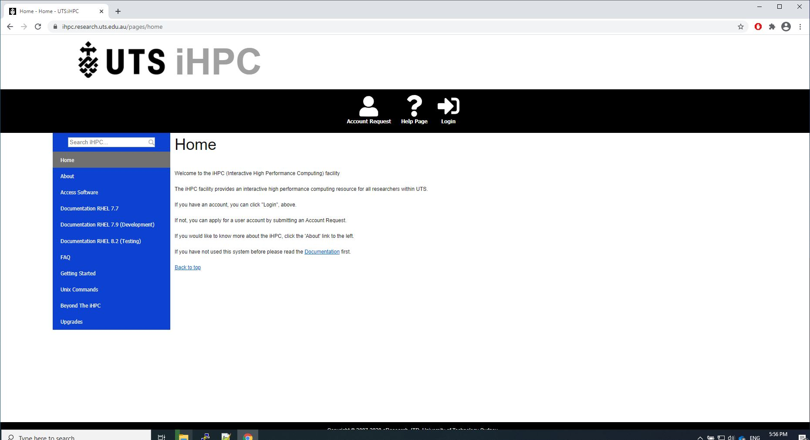
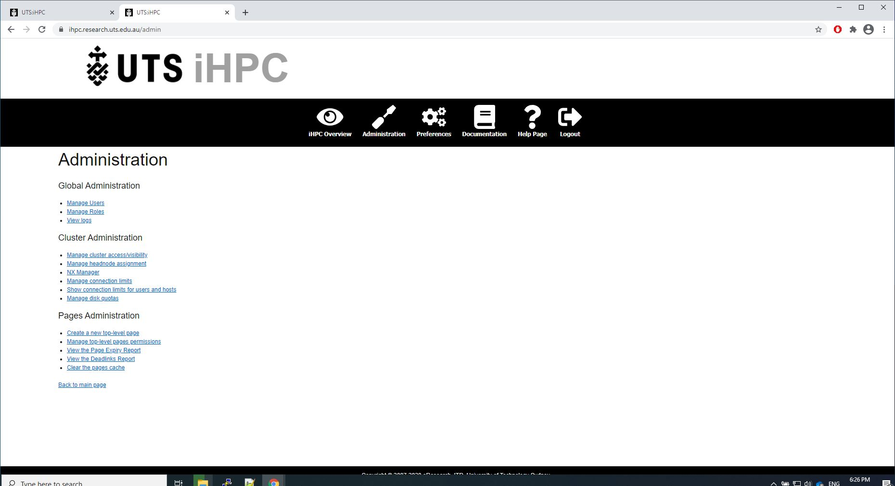
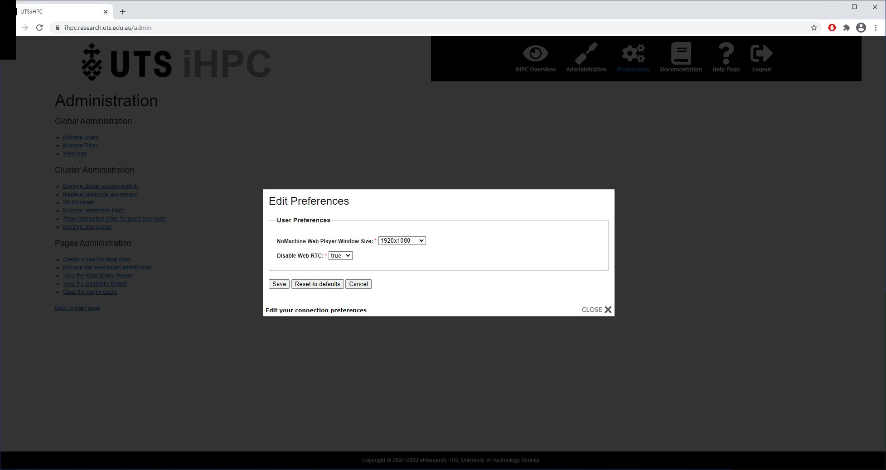

# High Performance Cluster (iHPC)

## Introduction
Most of my web development work for UTS was for the Intranet and not publicly available. 

Some of the larger projects such as when I worked in UTS's Faculty of IT were also decommissioned over the years.

However, I do have screen caps of my most recent project for UTS: iHPC (High Performance Cluster). 

iHPC is a collection of high performance servers used by students to run computationally-intense calculations.

The website had two major components: the overview page and the content management system. 
It also had a smaller set of pages for the home, administrators of the web site and for users to configure their preferences.

## Home Page

The home page allows users to login, to apply for an account, and to access documentation, and to seek help.

## Overview Page

The overview page (see overview1.jpg to overview3.jpg) displayed the details of the machine(s) that the current user is connected to and his/her quota limits.

Lower in the body of the page, for each machine in the cluster:
* the name of each machine was a link that would open a NoMachine NXSession to the server, allowing students and staff to have a graphical connection. 
* it showed a link to download the NXsession file to connect to the machine
* the general status of the machine (traffic light system to indicate load)
* CPU load
* memory load
* GPU load
* GPU memory 
* users currently connected to that machine
* a small clock graphic which had alt text that indicated when data was last received from this machine

The details for each machine was generated by a Java program then my PHP and jQuery code would refresh the contents of the web page 
without doing a full refresh. I'm particularly proud that the % images for CPU and memory load were generated using PHP and scalable vector graphics.
CSS was also used for this page.

## Content Management System

A content management system developed in-house at the Faculty of Engineering and IT. 
My main role regarding that was maintenance of the code and adding a WYSIWYG editor (CKEditor). 
The CMS was used to share documentation on the software available to students and how to use them. 

### Sample documentation - Viewing the page

### Sample documentation - Editing the page

## Admin pages

There is a section for admininstrators pages for debugging and configuring user access. 
Access that was configured include how many connections a specific user may have, how many connections a user from a specific department or faculty may have etc. 
The system also had a way of managing priorities in which filters were applied.

I have only shown a small sample of these features below.

### Accessing logs

This form uses PHP and MySQL - the logs were stored in a MySQL database.

### Managine roles

### Managing quotas.

## User preferences pages
There was a small section for storing user preferences. This was written in PHP and MySQL. I maintained the database schema. There used to be more functionality for user preferences but its scope was reduced.

